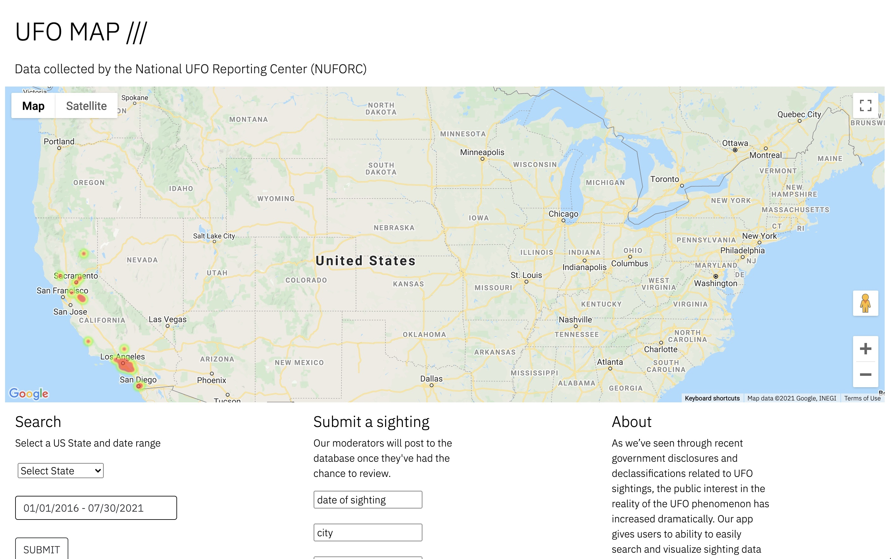

# UFO MAP

## About

UFO Map is an interactive user-friendly UFO sighting application. While using UFO Map you can search for sightings by both state and date. Once the search is complete the results will show up an a google heatmap. The heatmap with show in a variety of colors ranging from green (lowest) to red(most frequent). The user is also able to submit their own sightings through a form on the main page.

UFO Map was created in collaboration between Joe Merrell, Nick Mihaly, and Chad Renegar for UCLA’s Coding Bootcamp. The main technologies used for the project include:

- HTML
- CSS
- Bootstrap
- JavaScript
- MySql
- Google Maps
- Axios
- Express
- Express-Handlebars
- Express-Session
- Sequelize
- Environmental variables (.env)
- Node.js
- Heroku/JawsDB
  

The basic functions of the app are in place and working:

- Search by state and date range
- Submit a sighting
- Admin login
  

Next steps include:

- Add list of the mapped sightings on a separate page that opens when the the search is submitted
- Admin login will open a separate page that lists all of the user submitted sightings for evaluation and eventual addition to main map database
- Additional visualizations of search data, including a comparative chart of all US states for a given date range
  

<a href="[url](https://new-ufo.herokuapp.com/)">Link to the deployed app</a> 

<a href="[url](https://github.com/JoeMerrell/ufo-map)">Github repository</a> 

